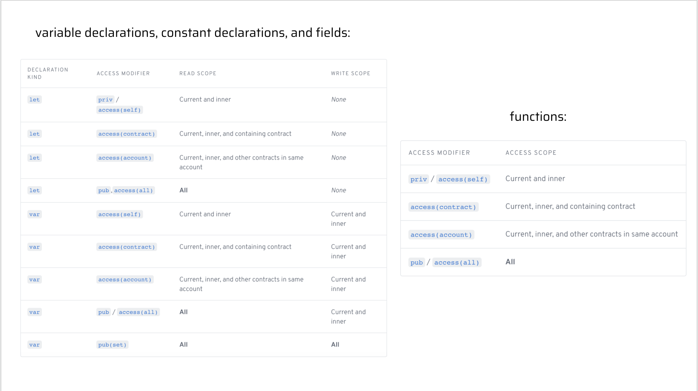

# Fast Floward | Week 2 | Day 1

Helloooo! Jacob here. You will be stuck with me for the remaining parts of the bootcamp (Weeks 2 and 3). You have probably seen me in the Discord answering questions, so I hope I'm not a total stranger. Although I am not as awesome as Morgan, I hope we can have some fun and learn so much more about Flow/Cadence together.

This week, we will wrap up our introduction to the Cadence programming language and begin to explore DappStarter, a platform created by the team at Decentology that allows developers like you to get a full-stack dApp running quickly.

You should begin by watching the videos below. The first video will wrap up Cadence concepts by going over Access Control & Contract Interfaces. The second video will give you an introduction to DappStarter.

# Videos

- [Access Control in Cadence]()
- [Contract Interfaces]()
- [DappStarter Setup]()

# Wrapping up Cadence

Last week, you went over a ton of Cadence concepts and basic syntax thanks to Morgan. This week we're going to wrap it up, first by covering Access Control and then by going over Contract Interfaces.

## Access Control

Access Control which describes the way in which we can use things called "Access Modifiers" to increase the security of our smart contracts. 

Previously, you may have declared all of your variable and functions using the `pub` keyword, like so:
```cadence
pub let x: Bool

pub fun jacobIsAwesome(): Bool {
  return true
}
```

But what exactly does `pub` mean? Why are we putting it there? Are there other things we can do instead? I want to answer those questions here.

Let's take a look at this diagram to help give us an idea of all the different access modifiers we can use.



In the video, we only focus on the `var` rows, because `let` does not have a write scope since it is a constant. I encourage you to watch the video before reading over this next section.

Note: [here is the playground from the video.](https://play.onflow.org/2cc441ff-d356-4e36-a45f-715278bd658f?type=account&id=b97af048-15a4-445d-95fe-a31becc2ce41)

### Scope

Well, what does scope even mean? Scope is the area in which you can access, modify, or call your "things" (variables, constants, fields, or functions). There are 4 types of scope:

1. All - this means we can access our thing from wherever we want. Inside the contract, in transactions and scripts, wherever.
2. Current & Inner - this means we can only access our thing from where the thing is defined and inside of that.
Ex. 
```cadence
pub struct TestStruct {
  
  pub var x: String

  // The "current and inner scope" is here...

  pub fun testFunc() {
    // and in here.
  }

  init(){...}
}
```
3. Containing Contract - this means we can access our thing anywhere inside the contract that our thing is defined.
Ex. 
```cadence
pub contract TestContract {
  // The "containing contract" is here...
  pub struct TestStruct {
    
    pub var x: String

    // here...

    pub fun testFunc() {
      // and in here.
    }

    init(){...}
  }
}
```
4. Account - this means we can access our thing anywhere inside the account that our thing is defined. Remember: we can deploy multiple contracts to one account.

### pub(set)

`pub(set)` only applies to variables, constants, and fields. Functions **cannot** be publically settable. It is also the most dangerous and easily accessible modifier.

Ex.
```cadence
pub(set) var x: String
```

Write Scope - **All**
Read Scope - **All**

### pub/access(all)

`pub` is the same thing as `access(all)`. This is the next layer down from pub(set).

Ex.
```cadence
pub var x: String
access(all) var y: String

pub fun testFuncOne() {}
access(all) fun testFuncTwo() {}
```

Write Scope - Current & Inner
Read Scope - **All**

### access(account)

`access(account)` is a little more restrictive than `pub` due to its read scope.

Ex.
```cadence
access(account) var x: String

access(account) fun testFunc() {}
```

Write Scope - Current & Inner
Read Scope - Account

### access(contract)

`access(contract)` is a little more restrictive than `access(account)` due to its read scope.

Ex.
```cadence
access(contract) var x: String

access(contract) fun testFunc() {}
```

Write Scope - Current & Inner
Read Scope - Containing Contract

### priv/access(self)

`priv` is the same thing as `access(self)`. This is the most restrictive (and safe) access modifier.

Ex.
```cadence
priv var x: String
access(self) var y: String

priv fun testFuncOne() {}
access(self) fun testFuncTwo() {}
```

Write Scope - Current & Inner
Read Scope - Current & Inner

## Contract Interfaces

# Quests

For day one, we have two quests: `W2Q1` and `W2Q2`. If you need assistance while solving these, feel free to ask questions on Discord in the **burning-questions** channel.

- `W2Q1` – Access Control Party

Look at the w2q1 folder. For this quest, you will be looking at 4 variables (a, b, c, d) and 3 functions (publicFunc, privateFunc, contractFunc) defined in SomeStruct. For each variable, tell me in which areas they can be read (read scope) and which areas they can be modified (write scope). For each function, simply tell me where they can be called. You will see I've marked 4 different areas (1, 2, 3 in some_contract.cdc, and 4 in some_script.cdc) where I want you to list.

Ex. In Area 1:
1. Variables that can be read: a and c.
2. Variables that can be modified: d.
3. Functions that can be accessed: publicFunc and privateFunc
Note: this is very wrong ^

- `W2Q2` – Dappiness


Best of luck on your quests. You're doing great!!!
